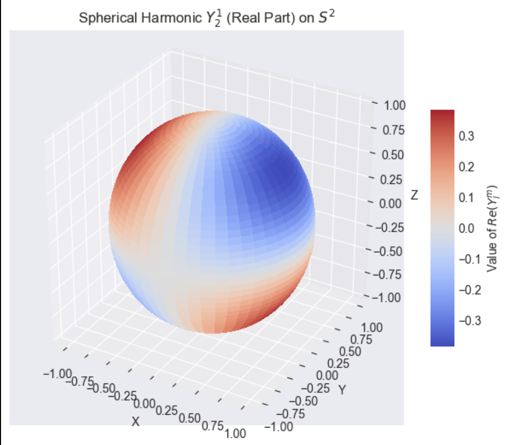

# Geometric Deep Learning on Homogeneous Spaces

## Overview

This repository contains a Jupyter notebook that provides an interactive exploration of Equivariant Neural Networks on Homogeneous Spaces, with a specific focus on Spherical CNNs. The notebook complements Lecture 8 from the "[Lie Groups with Applications](https://quantumformalism.academy/lie-groups-with-applications)" course through Quantum Formalism, demonstrating the deep connection between abstract Lie theory and modern geometric deep learning models.

## Key Concepts Explored

- **Homogeneous Spaces**: Visualization of the sphere S² as the quotient space SO(3)/SO(2) through the orbit of points under group actions
- **Feature Maps & Associated Vector Bundles**: Interactive demonstration of how vector fields on S² can be understood as sections of the tangent bundle, in terms of an associated vector bundle: $$TS^2 \cong SO(3) \times_{SO(2)} \mathbb{R}^2$$. 
- **Group Actions on Feature Fields**: Implementation of the "push-pull" formula for SO(3) action on vector fields
- **Spherical Harmonics**: Exploration of spherical harmonics as an equivariant basis for functions on the sphere
- **Harmonic Analysis & Spherical Harmonic Transform**: Numerical representation of spherical functions through their harmonic coefficients
- **Linear Equivariant Maps & Schur's Lemma**: Demonstration of how representation theory constrains the structure of equivariant linear maps
- **Convolution Equivalence**: Verification of the fundamental theorem (Cohen et al., 2019) linking equivariant maps to spherical convolutions
- **Practical Implementation with e3nn**: Construction and testing of SO(3)-equivariant layers using the e3nn library

## Visualizations

The notebook features several interactive visualizations:
- 3D rendering of spherical points and vector fields
- Group actions on geometric features
- Spherical harmonics as scalar fields on S²
- Equivariant vs. non-equivariant map outputs

## Mathematical Background

This material builds on differential geometry, representation theory, and harmonic analysis:
- **Lie Groups & Homogeneous Spaces**: The sphere S² as SO(3)/SO(2)
- **Induced Representations**: How vector fields on S² relate to representations of SO(2)
- **Spherical Harmonics**: As irreducible representations of SO(3)
- **Schur's Lemma**: Application to equivariant maps between function spaces
- **Convolution Theorem**: The equivalence between equivariant maps and convolutions

## Applications

These concepts form the backbone of equivariant deep learning models with applications in:
- Climate science and weather prediction
- 3D computer vision and point cloud processing
- Molecular modeling and drug discovery
- Astrophysics and cosmology (CMB analysis)
- Computer graphics and 3D shape analysis

## Requirements

- Python 3.8+
- NumPy, SciPy
- Matplotlib
- PyTorch
- e3nn (Equivariant Neural Network library)

## Usage

This notebook can be run with standard Jupyter environments. Each code cell builds on previous sections, gradually constructing the full picture of equivariant neural networks on homogeneous spaces.

## References

- Cohen, T. S., Geiger, M., & Weiler, M. (2019). *A General Theory of Equivariant CNNs on Homogeneous Spaces*. NeurIPS 32.
- Gerken, J.E., Aronsson, J., Carlsson, O. et al. *Geometric deep learning and equivariant neural networks*. Artif Intell Rev 56, 14605–14662 (2023).

## About the Author

[Brian Hepler, PhD](https://www.linkedin.com/in/brian-hepler-phd/) is a research mathematician exploring connections to data science, machine learning, and quantum computing. This material was developed as part of the "[Lie Groups with Applications](https://quantumformalism.academy/lie-groups-with-applications)" course at Quantum Formalism Academy.

## License

Copyright © 2025 Quantum Formalism Academy. All rights reserved.
This repository is intended for educational purposes. Redistribution, modification, or commercial use of this material without prior written permission is prohibited.
